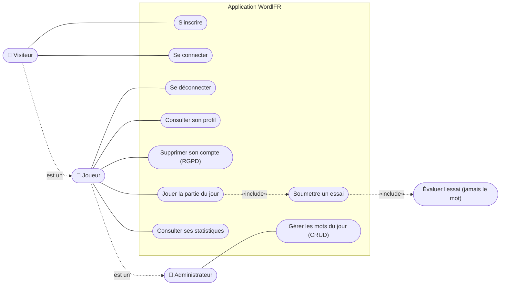
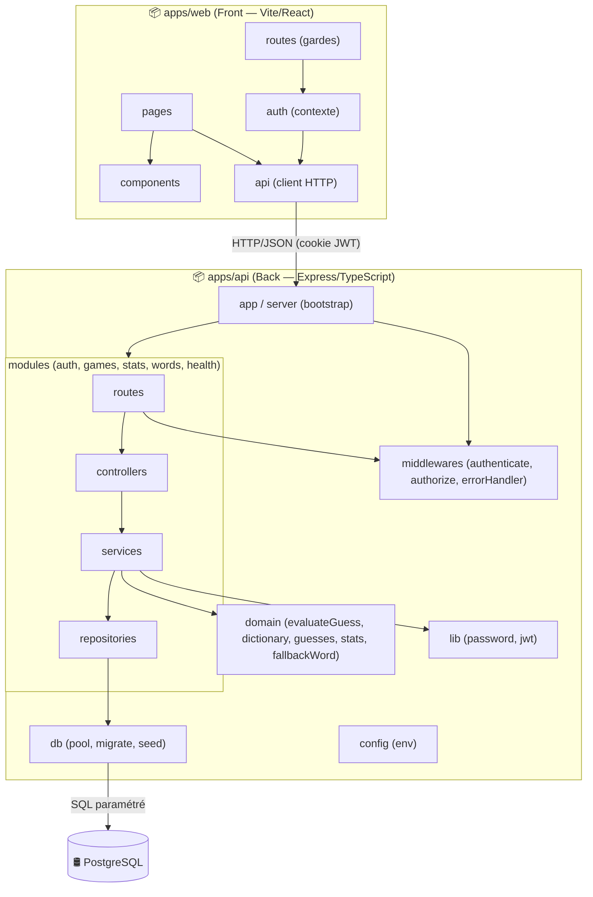
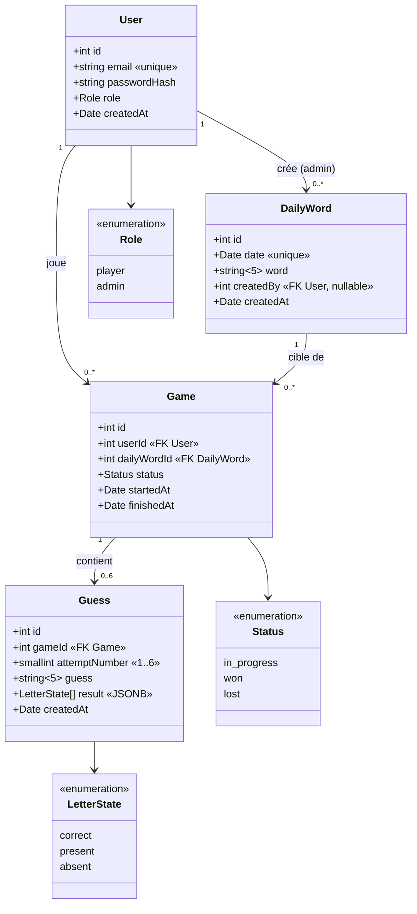
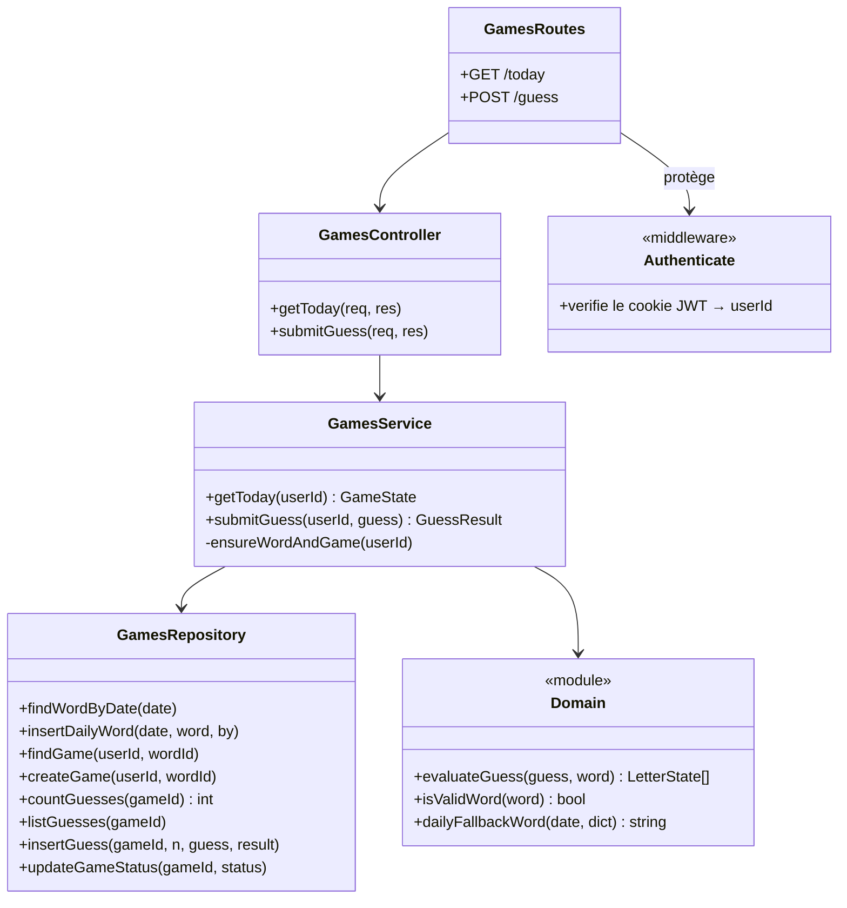
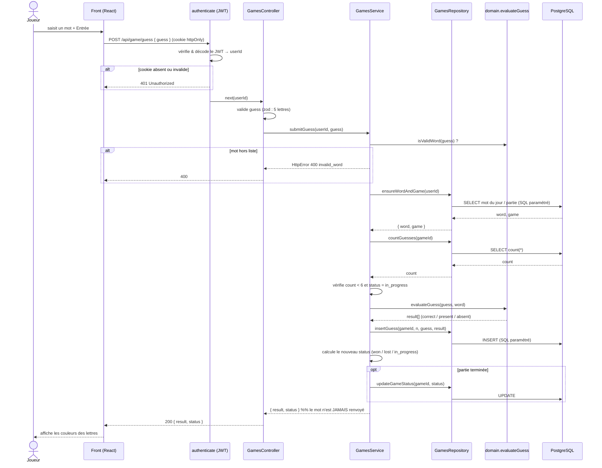

# Diagrammes UML — WordlFR (CDA RNCP 37873)

> Diagrammes au format **Mermaid** : ils se rendent automatiquement sur GitHub
> et dans VS Code (extension *Markdown Preview Mermaid Support*).
> Tous sont dérivés du **code réel** de l'application (modules, schéma SQL, flux).
>
> Export image : copier un bloc sur [mermaid.live](https://mermaid.live) → PNG/SVG
> pour l'insérer dans le dossier.

---

## 1. Diagramme des cas d'utilisation

Trois acteurs avec héritage : un **Joueur** est un Visiteur authentifié, un
**Administrateur** est un Joueur disposant de droits supplémentaires.

**Règles métier portées par les cas d'utilisation :**
- `Jouer la partie du jour` inclut `Soumettre un essai` (6 essais maximum, imposé côté serveur).
- L'évaluation d'un essai ne renvoie **jamais** le mot cible (anti-triche).
- `Gérer les mots du jour` est réservé au rôle `admin` (middleware d'autorisation).

---

## 2. Diagramme de paquets

Architecture **3-tier** : le front (SPA) consomme l'API ; l'API est découpée en
couches (routes → contrôleurs → services → repositories) ; seuls les repositories
accèdent à PostgreSQL.

**Dépendances clés (sens des flèches) :** une couche ne dépend que de la couche
inférieure. La logique métier (`services` + `domain`) ne connaît pas SQL ;
le SQL est confiné dans `repositories` + `db`.

---

## 3. Diagramme de classes

### 3.1 Modèle de données (entités persistées)

Reflète fidèlement le schéma SQL (`db/migrations`).

**Contraintes notables :** `UNIQUE(user_id, daily_word_id)` (une seule partie par
joueur et par jour), `UNIQUE(game_id, attempt_number)`, `ON DELETE CASCADE`
(suppression de compte → parties → essais, support du droit à l'oubli).

### 3.2 Couches applicatives (module *games* en exemple)

L'API n'est pas orientée objet classique mais organisée en **fabriques de
services** (closures TypeScript). On les représente comme des classes pour le
dossier.

---

## 4. Diagramme de séquence — soumettre un essai

Scénario `POST /api/game/guess` : il illustre le flux 3-tier complet **et** la
mesure anti-triche (décompte des essais côté serveur, mot jamais renvoyé).

---

## Correspondance avec les blocs CDA

| Diagramme | Compétence couverte |
|-----------|---------------------|
| Cas d'utilisation | BC02 — analyser le besoin |
| Paquets | BC02 — définir l'architecture logicielle en couches |
| Classes (entités) | BC02 — concevoir la base de données relationnelle |
| Classes (couches) | BC01/BC02 — composants métier et d'accès aux données |
| Séquence | BC01 — composants métier ; illustration de l'anti-triche |
