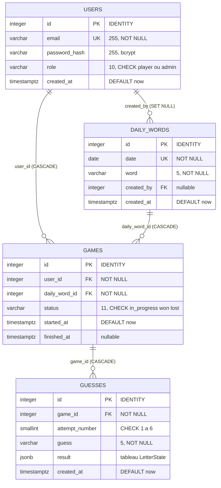

# Modèle de données — MCD / MLD

## MCD (Modèle Conceptuel de Données)

```
┌──────────────┐        ┌─────────────────┐         ┌──────────────┐
│    USERS     │        │   DAILY_WORDS   │         │    GAMES     │
│──────────────│        │─────────────────│         │──────────────│
│ id (PK)      │◄───────┤ created_by (FK) │         │ id (PK)      │
│ email        │  crée  │ id (PK)         │◄────────┤ daily_word_id│
│ password_hash│        │ date (UNIQUE)   │ pour    │ user_id (FK) │
│ role         │        │ word            │         │ status       │
│ created_at   │        │ created_at      │         │ started_at   │
└──────────────┘        └─────────────────┘         │ finished_at  │
        │                                           └──────┬───────┘
        │ joue                                             │ contient
        └──────────────────────────────────────────────────┘
                                                           │
                                                    ┌──────▼───────┐
                                                    │    GUESSES   │
                                                    │──────────────│
                                                    │ id (PK)      │
                                                    │ game_id (FK) │
                                                    │ attempt_num  │
                                                    │ guess        │
                                                    │ result (JSONB│
                                                    │ created_at   │
                                                    └──────────────┘
```

**Cardinalités :**
- `USERS` 1—* `GAMES` (un joueur a plusieurs parties)
- `DAILY_WORDS` 1—* `GAMES` (un mot du jour a plusieurs parties)
- `GAMES` 1—* `GUESSES` (une partie a plusieurs essais)
- `USERS` 1—* `DAILY_WORDS` (un admin crée plusieurs mots) [optionnel — `ON DELETE SET NULL`]

**Contrainte métier :** `UNIQUE(user_id, daily_word_id)` — un joueur ne joue qu'une seule fois par mot du jour.

## MLD (Modèle Logique de Données)

```sql
users (
  id            INTEGER GENERATED ALWAYS AS IDENTITY PRIMARY KEY,
  email         VARCHAR(255) NOT NULL UNIQUE,
  password_hash VARCHAR(255) NOT NULL,
  role          VARCHAR(10)  NOT NULL DEFAULT 'player'
                CHECK (role IN ('player','admin')),
  created_at    TIMESTAMPTZ  NOT NULL DEFAULT now()
)

daily_words (
  id         INTEGER GENERATED ALWAYS AS IDENTITY PRIMARY KEY,
  date       DATE        NOT NULL UNIQUE,
  word       VARCHAR(5)  NOT NULL,
  created_by INTEGER     REFERENCES users(id) ON DELETE SET NULL,
  created_at TIMESTAMPTZ NOT NULL DEFAULT now()
)

games (
  id            INTEGER GENERATED ALWAYS AS IDENTITY PRIMARY KEY,
  user_id       INTEGER NOT NULL REFERENCES users(id) ON DELETE CASCADE,
  daily_word_id INTEGER NOT NULL REFERENCES daily_words(id) ON DELETE CASCADE,
  status        VARCHAR(11) NOT NULL DEFAULT 'in_progress'
                CHECK (status IN ('in_progress','won','lost')),
  started_at    TIMESTAMPTZ NOT NULL DEFAULT now(),
  finished_at   TIMESTAMPTZ,
  UNIQUE (user_id, daily_word_id)
)

guesses (
  id             INTEGER  GENERATED ALWAYS AS IDENTITY PRIMARY KEY,
  game_id        INTEGER  NOT NULL REFERENCES games(id) ON DELETE CASCADE,
  attempt_number SMALLINT NOT NULL CHECK (attempt_number BETWEEN 1 AND 6),
  guess          VARCHAR(5) NOT NULL,
  result         JSONB    NOT NULL,  -- ["correct","present","absent","absent","correct"]
  created_at     TIMESTAMPTZ NOT NULL DEFAULT now(),
  UNIQUE (game_id, attempt_number)
)

INDEX idx_games_user   ON games(user_id)
INDEX idx_guesses_game ON guesses(game_id)
```

## MPD (Modèle Physique de Données)

Cible : **PostgreSQL 16**. Le MPD ajoute au MLD les éléments dépendants du SGBD :
types physiques exacts, génération des clés, index (B-tree) et stockage JSONB.
Il est **implémenté tel quel** dans `apps/api/src/db/migrations/*.sql`.



**Choix physiques propres à PostgreSQL :**

| Élément | Choix physique | Raison |
|---------|----------------|--------|
| Clé primaire | `INTEGER GENERATED ALWAYS AS IDENTITY` | clés auto sans séquence à gérer (SQL:2003) |
| Horodatage | `TIMESTAMPTZ` | stockage en UTC, fuseau géré côté SGBD |
| Résultat d'un essai | `JSONB` | tableau `LetterState[]` lu en bloc, stockage binaire indexable |
| Unicité métier | `UNIQUE(user_id, daily_word_id)`, `UNIQUE(date)` | 1 partie/joueur/jour, 1 mot/date |
| Intégrité | `FK` + `CHECK` + `ON DELETE CASCADE / SET NULL` | cohérence garantie par le SGBD |
| Index | B-tree `idx_games_user`, `idx_guesses_game` | accélère les jointures fréquentes (stats, essais) |

> Contrainte d'unicité `UNIQUE(game_id, attempt_number)` : empêche deux essais
> portant le même numéro pour une partie (idempotence des insertions).

## Justification des choix

- **JSONB pour `result`** : le tableau de 5 états `LetterState[]` est une donnée atomique lue en bloc, jamais interrogée par champ — le stockage JSONB est plus simple et performant que 5 colonnes séparées.
- **`GENERATED ALWAYS AS IDENTITY`** : standard SQL:2003, sans séquence explicite à gérer.
- **`ON DELETE CASCADE`** : la suppression d'un compte joueur (RGPD) entraîne la suppression en cascade de ses parties et essais.
- **`ON DELETE SET NULL`** sur `daily_words.created_by` : conserver les mots planifiés même si l'admin qui les a créés est supprimé.
- **Statistiques en SQL pur** (pas de table dénormalisée) : agrégation en `COUNT`, `SUM`, `JOIN` — démontre la maîtrise SQL et évite la redondance de données.
