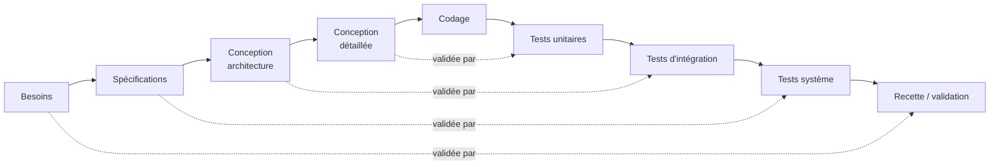
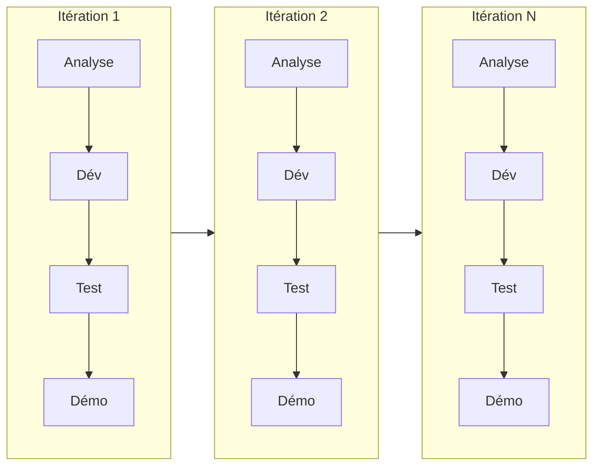

# Méthodologie de gestion de projet — WordlFR (CDA RNCP 37873)

> Document de cadrage méthodologique pour le dossier CDA (compétence
> **BC01 — Contribuer à la gestion d'un projet informatique**). Il présente les
> deux grandes approches (cycle en V et Agile), justifie celle retenue pour
> WordlFR, et la rattache aux **artefacts réels** du projet (phases, Git,
> intégration continue, plan de tests).

---

## 1. Les deux grandes familles de cycle de vie

### 1.1 Le cycle en V
Modèle **séquentiel** : chaque phase de conception (descendante) est associée à
une phase de validation (montante) symétrique.

- **Forces** : traçabilité besoin → test forte, documentation complète, adapté aux périmètres figés.
- **Limites** : rigide, effet tunnel (le client ne voit le produit qu'à la fin), coûteux à corriger si un besoin évolue tard.

### 1.2 L'approche Agile (itérative et incrémentale)
Le produit est construit par **incréments** courts, chacun livrant une
fonctionnalité testée et démontrable. On inspecte et on adapte à chaque itération.

- **Forces** : feedback rapide, adaptation au changement, valeur livrée tôt, qualité continue (tests à chaque incrément).
- **Limites** : nécessite de la discipline, documentation parfois plus légère, périmètre mouvant à cadrer.

### 1.3 Comparaison synthétique

| Critère | Cycle en V | Agile |
|---------|-----------|-------|
| Déroulé | séquentiel, une passe | itératif, incréments |
| Réaction au changement | faible | forte |
| Première version utilisable | en fin de projet | dès la 1ʳᵉ itération |
| Documentation | exhaustive en amont | continue, « juste assez » |
| Traçabilité tests | native (symétrie du V) | via tests automatisés + CI |
| Contexte idéal | besoin figé, fort enjeu normatif | besoin évolutif, time-to-market |

---

## 2. Approche retenue pour WordlFR : **Agile itératif et incrémental**

Le projet a été mené en **itérations livrables**, chacune produisant un incrément
**testé, intégré et déployable**. Ce choix est justifié par :

1. **Périmètre amené à s'affiner** : le cœur de jeu (anti-triche) et l'UX se sont
   précisés au fil des essais — l'itératif permet d'ajuster sans tout refondre.
2. **Qualité continue** : chaque incrément est couvert par des tests automatisés
   exécutés en intégration continue → pas d'effet tunnel.
3. **Valeur démontrable tôt** : dès la phase 1, l'authentification était
   fonctionnelle et testée.
4. **Contexte de développeur solo** : une démarche Agile **allégée** (façon
   Kanban : un flux de tâches « à faire → en cours → fait ») est plus adaptée
   qu'un Scrum complet à plusieurs rôles.

> **Hybridation assumée** : on **conserve l'apport clé du cycle en V** — la
> traçabilité *besoin → test* — via le [plan de tests](plan-de-tests.md) et les
> tests d'intégration, tout en gardant la souplesse itérative de l'Agile.

---

## 3. Découpage réel en itérations

Les incréments correspondent aux phases effectivement réalisées (visibles dans
l'historique Git) :

| Itération | Objectif | Livrable testé |
|-----------|----------|----------------|
| **1 — Fondations** | Monorepo, BDD, authentification | JWT + bcrypt, tests auth |
| **2 — Cœur de jeu** | Logique anti-triche, persistance des essais | `POST /guess`, 11 tests jeu |
| **3 — Stats & admin** | Statistiques joueur, CRUD mots du jour | `/stats`, `/admin/words` + tests |
| **4 — Interface** | Front React (jeu, stats, admin, auth), RGAA | UI complète, build Vite |
| **5 — Industrialisation** | Docker, CI, déploiement, documentation | CI verte, déploiement Render |

Chaque itération suit le micro-cycle **analyser → développer → tester → intégrer**.

---

## 4. Outils et pratiques de gestion de projet

| Pratique | Mise en œuvre dans WordlFR |
|----------|----------------------------|
| **Gestion de versions** | Git + GitHub ; branche de fonctionnalité `feat/cda-fullstack`, intégration dans `main` via **Pull Request** (merge commit traçable) |
| **Intégration continue (CI)** | `.github/workflows/ci.yml` — type-check + 54 tests à chaque push/PR ; un échec bloque le merge |
| **Définition de « terminé » (DoD)** | une tâche est *finie* quand : code écrit, **tests verts**, build OK, documentation à jour |
| **Suivi des tâches** | découpage en tâches (« à faire / en cours / fait »), façon tableau Kanban |
| **Commits atteignables** | messages conventionnels (`feat`, `fix`, `docs`, `test`) pour un historique lisible |
| **Revue** | relecture du diff avant merge (auto-revue + outils) |

---

## 5. Traçabilité besoin → test (héritage du cycle en V)

Pour ne pas perdre la rigueur du V, chaque besoin est relié à un test
automatisé. Exemples :

| Besoin | Critère de validation | Test (preuve) |
|--------|----------------------|---------------|
| Le mot cible reste secret | aucune réponse ne contient le mot | *« word NEVER exposed »* (`game.test.ts`) |
| 6 essais maximum | le 7ᵉ essai est refusé côté serveur | *« enforces 6-attempt limit »* |
| Cloisonnement des joueurs | un joueur ne voit pas la partie d'un autre | *« game isolation »* |
| Droit à l'oubli (RGPD) | suppression de compte → données effacées | *« deletes the account »* (`auth.test.ts`) |
| Accès admin protégé | un joueur non-admin est refusé (403) | *« returns 403 for non-admin »* (`words.test.ts`) |

Voir le détail dans [`plan-de-tests.md`](plan-de-tests.md) et [`preuves-api.md`](preuves-api.md).

---

## 6. Rétrospective (amélioration continue)

Bilan tiré au fil des itérations, dans l'esprit Agile :

- **Ce qui a bien marché** : la couverture de tests a permis de refactorer
  (ex. liste de mots, animation) sans régression ; la CI a sécurisé chaque merge.
- **Difficultés & adaptations** : incompatibilités `pg-mem` (cast de dates)
  contournées ; bug d'animation et de verrouillage de saisie **reproduits puis
  corrigés** avec un serveur de test temporaire.
- **Pistes d'amélioration** : ajouter des tests end-to-end (Playwright),
  un export RGPD des données, et un suivi de tâches outillé (GitHub Projects).

---

## 7. Conclusion

WordlFR a été conduit selon une **démarche Agile itérative et incrémentale**,
adaptée à un développeur solo (cadence Kanban, DoD centrée sur les tests),
tout en **empruntant au cycle en V sa traçabilité besoin → test**. Ce choix
hybride concilie souplesse, qualité continue et rigueur documentaire — les trois
attendus du référentiel CDA.
